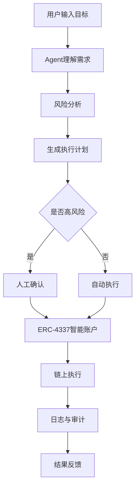

## 一、AI × Web3 问题地图

| 方向                          | AI 作用           | Web3 机制                             |
| --------------------------- | --------------- | ----------------------------------- |
| Agent Wallet                | 理解用户意图、自动生成交易计划 | MPC、ERC-4337、Safe、Policy Engine     |
| DAO Governance Assistant    | 提案总结、会议纪要、贡献跟踪  | DAO、投票、Treasury、多签                  |
| Agent Identity & Reputation | 能力发现、信誉分析       | ENS、EAS、ERC-8004                    |
| DeFi Strategy Agent         | 收益分析、风险评估、自动执行  | DEX、Lending Protocol、Smart Contract |
| Public Goods Coordination   | 信息整理、贡献统计、项目匹配  | Gitcoin、Funding、链上记录                |

## 二、方向选择说明

### 选择方向

Agent Wallet（Agentic Wallet）

### 为什么不是纯 AI 问题

仅靠 AI 可以理解用户意图，但无法安全地执行资产操作、管理权限和完成链上交易。

### 为什么不是纯 Web3 问题

仅有钱包、多签和智能账户并不能自动理解用户需求、生成执行计划或进行风险分析。

## 三、问题拆解

### 参与方

* 用户
* Agent
* Wallet
* 智能账户
* 链上协议
* 审计与监控系统

### 流程

用户提出目标
→ Agent理解需求
→ 生成执行计划
→ 风险检查
→ 人工确认（高风险）
→ 钱包签名
→ 链上执行
→ 记录与审计

### AI 作用

* 自然语言理解
* 风险分析
* 执行规划
* 状态追踪

### Web3 机制

* ERC-4337
* MPC
* Safe
* Policy Engine
* 链上日志

### 自动化边界

* 查询余额
* 查询价格
* 小额交易
* 状态跟踪

### 人工确认点

* 转账
* Approve
* 大额交易
* 新协议交互
* 权限变更

### 验证方式

* 模拟执行
* 链上交易记录
* 审计日志
* Policy检查

### 主要风险

* Prompt Injection
* 无限Approve
* 权限升级
* 错误交易
* 私钥泄露

## 四、项目初步 Proposal

### 项目名称

安全钱包助手

### 目标用户

* Web3 普通用户
* DAO财务管理员
* DeFi 用户

### 真实场景

用户输入：

“帮我把100 USDC存入收益最高且风险较低的协议”

Agent：

* 查询收益率
* 分析风险
* 生成计划
* 请求确认
* 执行交易
* 返回结果

### 最小功能（MVP）

1. 钱包连接
2. 自然语言任务输入
3. 风险分析
4. 交易模拟
5. 人工确认
6. 执行记录

### 验证方式

* 用户成功完成任务
* 用户理解执行过程
* 无超预算执行
* 所有操作可追踪

### 主要风险

* 错误推荐
* 恶意合约
* Prompt Injection
* 权限配置错误

### 可能赛道

* Agent
* AI × DeFi
* Wallet Infrastructure
* AI Security

### Week 3 下一步

* 设计Agent Profile
* 设计权限模型
* 绘制完整执行流程
* 制作MVP原型

## 五、参考资料清单

### 1. ERC-4337

帮助判断：

账户抽象如何支持Agent执行与权限控制。

### 2. Safe Smart Account

帮助判断：

多签、Guard和Policy如何控制风险。

### 3. Cobo Agentic Wallet

帮助判断：

生产环境Agent Wallet如何实现任务级授权。

### 4. MCP（Model Context Protocol）

帮助判断：

Agent如何安全调用外部工具。

### 5. ERC-8004

帮助判断：

Agent身份、任务和信誉体系如何建立。

## 六、主方向深挖包

### 流程图

### 典型场景

用户：

“帮我把100 USDC换成ETH并存入Aave。”

Agent：

* 查询价格
* 检查风险
* 模拟执行
* 请求确认
* 执行交易
* 返回结果

### 反例

危险Demo：

用户授权Agent全部钱包权限。

Agent：

* 无预算限制
* 无白名单
* 无人工确认

结果：

一次Prompt Injection即可导致全部资产损失。

### 关键风险

1. Prompt Injection
2. 恶意合约
3. Session Key泄露
4. Policy配置错误
5. 超预算执行

### 最小验证计划

测试用户：

5名Web3用户

测试任务：

“将50 USDC存入指定协议”

验证指标：

* 是否成功完成
* 是否理解风险提示
* 是否触发正确确认流程
* 是否记录完整日志

成功标准：

80%以上用户能够独立完成任务并理解执行过程。

## 七、方向 Backlog

### DAO Governance Assistant

暂不选择原因：

治理流程复杂，需要大量社区数据，验证周期较长。

### Public Goods Funding Assistant

暂不选择原因：

涉及治理和资金分配，价值判断较强，不适合作为Hackathon MVP。
