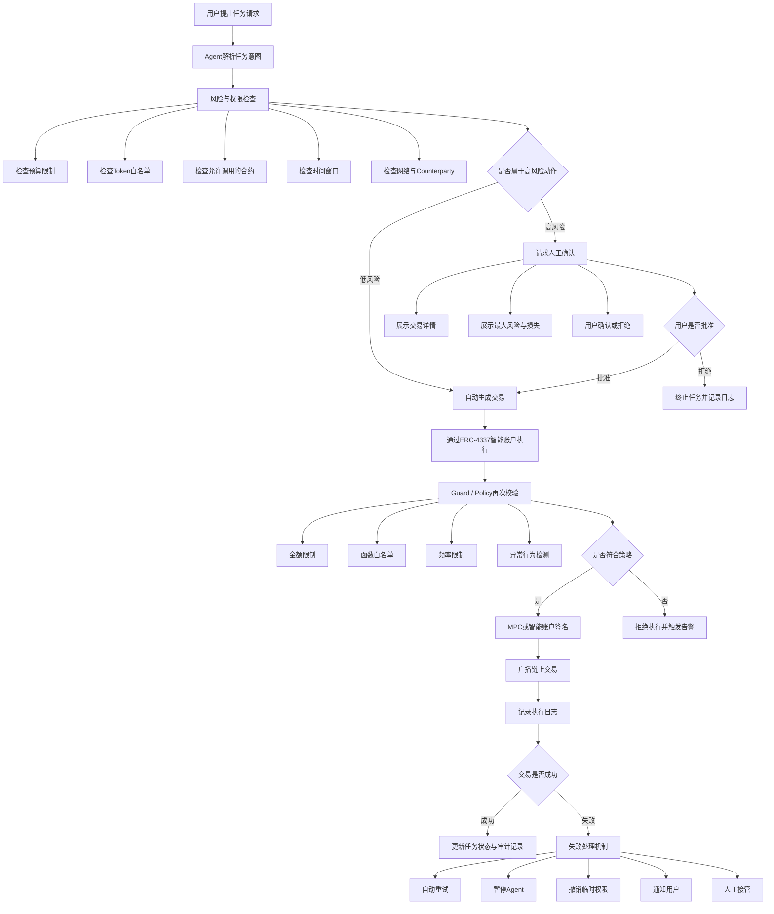

---

预算限制
单日最多 500 USDC

可调用合约
仅允许调用白名单合约

可执行动作
deposit、withdraw、small swap

人工确认阈值
≥100 USDC 或涉及新合约时必须确认

撤销方式
一键暂停、Session Key失效、移除Agent权限、合约白名单更新、紧急冻结

日志记录
谁发起任务、Agent执行了什么、调用了哪个合约、使用了多少资金、交易Hash、是否人工确认、失败原因

失败处理
自动切换节点、自动终止、暂停执行、进入人工审核、冻结Agent权限、触发安全告警

ERC-4337让传统钱包变成了可编程，解决了私钥暴露时间长、Agent权限过大、自动化不可控、使用体验差的风险

Safe将钱包变成可治理的执行系统，解决了多签风险、Agent权限隔离、审计问题

Guard / Policy是决定不是能不能签名而是该不该，解决了恶意合约调用、自动化失控、超额等风险
