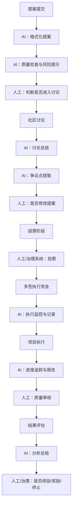

资助流程
提出资助申请→ 社区讨论→ 提案修改→ 投票→ 多签执行资金发放→ 项目执行→ 进度汇报→ 结果评估→ 复盘与归档

---

Proposal Summarizer

AI：提案结构化摘要、风险分析、历史对比

人工：是否进入投票流程、是否符合DAO方向、是否批准资金申请

meeting-to-action workflow

AI：会议纪要结构化、代办事项生成、依赖分析

人工：待办事项是否正确、所有者是否被确认接受任务、是否正式进入执行阶段、是否公开发布纪要

contribution tracker

AI：贡献数据聚合、贡献分类、贡献报告生成

人工：贡献是否高质量、是否给予奖励、是否影响声誉/激励分配、是否计入正式DAO记录
