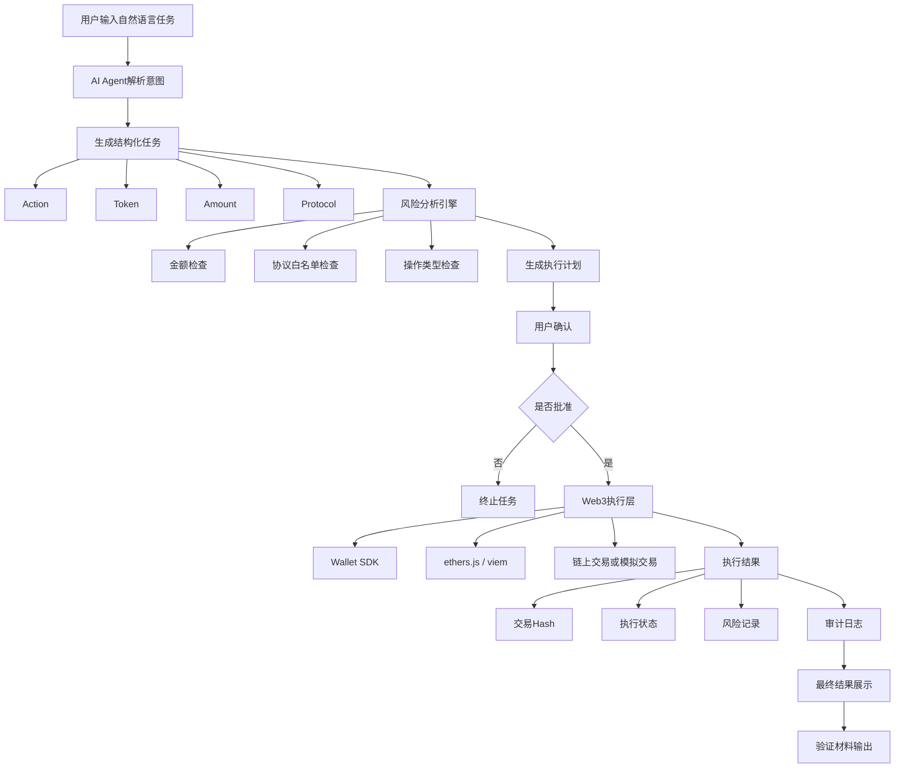

```mermaid
flowchart TD

A[用户输入自然语言任务] --> B[AI Agent解析意图]

B --> C[生成结构化任务]

C --> C1[Action]
C --> C2[Token]
C --> C3[Amount]
C --> C4[Protocol]

C --> D[风险分析引擎]

D --> D1[金额检查]
D --> D2[协议白名单检查]
D --> D3[操作类型检查]

D --> E[生成执行计划]

E --> F[用户确认]

F --> G{是否批准}

G -->|否| H[终止任务]

G -->|是| I[Web3执行层]

I --> I1[Wallet SDK]
I --> I2[ethers.js / viem]
I --> I3[链上交易或模拟交易]

I --> J[执行结果]

J --> J1[交易Hash]
J --> J2[执行状态]
J --> J3[风险记录]

J --> K[审计日志]

K --> L[最终结果展示]

L --> M[验证材料输出]
```

---
