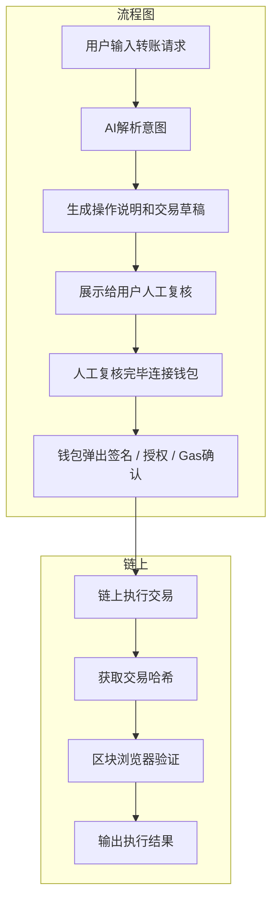

解决的问题：用 AI 帮用户理解和准备链上操作，但不允许 AI 直接执行任何高风险动作

---

用户输入示例：帮我把 0.01 ETH 转到测试网地址 0xabc123...

输出结果示例：
Transaction sent
Hash: 0x9f3a...
Status: Success

人工确认：签名、授权、Gas费用确认、网络选择

风险：AI 误解释交易意图、误签授权、网络或地址错误

验证结果：使用给出的交易哈希去到区块链浏览器查询
